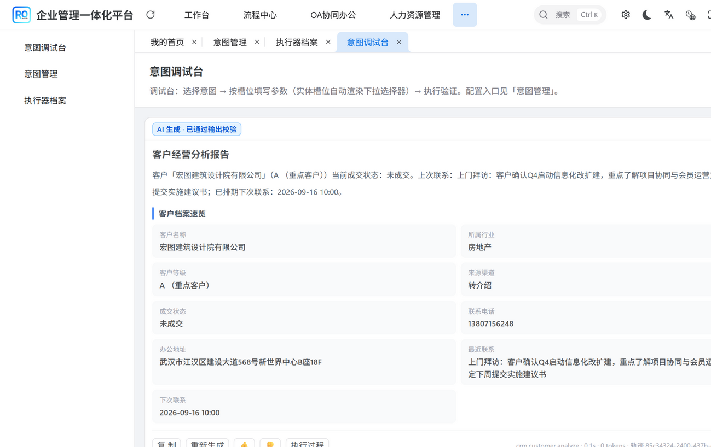
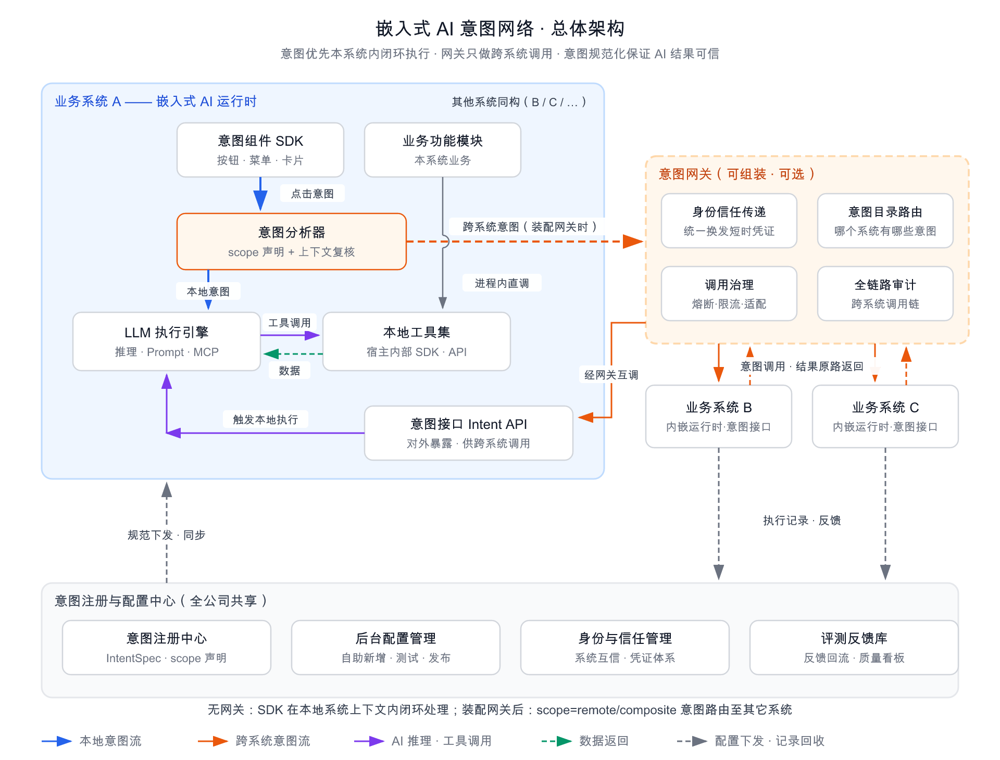

**English** · [中文](#chinese)

<a name="english"></a>
# intent-sdk

### Intent as a Service — the AI capability belongs *in* the page, not in a chat box

[](https://github.com/intent-as-a-service/intent-sdk/actions/workflows/ci.yml)
[](./LICENSE)


**The page already knows who the user is, what they may see, and which record is open.** intent-sdk
turns that page into an AI surface: a row of **intent buttons**, one click, and a **structured result
card** renders in place. The model runs **in-process, as a native SDK inside your application** —
permission checks, transactions and data-scope filters ride the host call stack, because a tool call
*is* an ordinary service call.

No second account system. No cross-domain hop. No data leaving your boundary.



**In one sentence:** move *what can be asked, how it should be asked, and what the answer looks like*
out of the user's head and into the system.

---

## Why teams reach for it

| | The chat-box way | **intent-sdk** |
|---|---|---|
| Entry point | One global chat box | Intent buttons on the page, loaded per page |
| Who phrases the request | The user has to guess | The system declares it — id / params / tool allow-list / output contract |
| Output | A paragraph of prose | A **standard result envelope** (`title` / `summary` / `blocks` / `followups` / `nextIntents`) that the UI renders directly |
| Getting the answer into the workflow | Copy-paste, by hand | The "next step" chips in the card are clickable (re-run with extra input / AI-recommended intent / host todo) |
| Permissions, transactions, data scope | Have to be rebuilt | Tools call host services **in-process**, so both follow the call stack |
| Shipping a new AI capability | A release | Intent specs and fact rules are YAML — **effective on save** |

## Try it in 60 seconds

**Step 1 — build the SDK.** All six modules, executors included, and nothing beyond Maven Central:

```bash
git clone https://github.com/intent-as-a-service/intent-sdk.git
cd intent-sdk && mvn install -DskipTests
```

*(`0.1.0-SNAPSHOT` is not on Maven Central yet, which is why this step is a source install. It
becomes a plain dependency once publishing lands.)*

**Step 2 — run a real app with intents already wired in:**

```bash
git clone https://github.com/intent-as-a-service/ruoyi-office.git    # 40 intents, full CRM chain
# or
git clone https://github.com/intent-as-a-service/RuoYi-Vue-Plus.git  # 14 intents, system / monitor
```

Follow that host's README (import SQL → start backend → start front end), then open the console the
host serves at `/intent-ui/index.html` and press the floating AI button in any admin page. No code
written yet, and the intents already work.

## What you get in the box

| Module | Depends on | Purpose |
|---|---|---|
| `intent-protocol` | Jackson only | Protocol DTOs: `IntentSpec` / `IntentRequest` / `IntentResult` / `CatalogResponse`… local and remote results share one shape |
| `intent-sdk-core` | Jackson only — **no Spring, no pi** | Execution engine core: spec loading and validation, orchestration, catalog assembly, tool contract |
| `intent-sdk-host` | core | Host SPI (identity / permissions / context / repositories) + a **declarative fact-rule engine** |
| `intent-sdk-pi` | core + **pi-ai / pi-agent** | Executor implementations: the `builtin-agent` reasoning loop, deterministic `skill` steps, `flow` orchestration |
| `intent-sdk-gateway` | core | Cross-system intent gateway client (**optional** — leave it out and everything stays local) |
| `intent-spring-boot-starter` | host + Spring Boot | Auto-configuration: default SPI implementations plus rule-engine wiring |

**Pure-process mode needs no LLM at all**: exclude `intent-sdk-pi` and the `skill` / `flow` executors
keep working — the core modules depend on Jackson and nothing else.

## Proof, not promises

| Scenario | Duration | Tokens |
|---|---|---|
| agent-type intent (reasoning loop + 11 tool calls) | 19–23 s | 7.7k–10.8k |
| **skill-type intent (pure tool steps, zero LLM)** | **13–51 ms** | **0** |

A data-fetching intent that needs no live judgement belongs in a skill-type executor profile: two to
three orders of magnitude faster, zero token cost, and the output is auditable.

**Hosts already running this SDK as a native, in-process dependency:**

| Host | Stack | Intents shipped |
|---|---|---|
| [ruoyi-office](https://github.com/intent-as-a-service/ruoyi-office) | yudao + Vben (Ant Design) | 40 — full CRM chain |
| [RuoYi-Vue-Plus](https://github.com/intent-as-a-service/RuoYi-Vue-Plus) | RuoYi-Vue-Plus + plus-ui (Element Plus) | 14 — account hygiene / permission review / login anomalies / cache diagnosis… |

## An intent, end to end

**1 — Wrap a host capability as a tool (Java, one to three per intent):**

```java
@Component
public class OrderQueryTool implements IntentTool {

    private final OrderService orderService;   // inject the host service directly

    @Override public String name() { return "order_query"; }

    @Override public String description() {
        // This text goes straight into the model prompt and decides whether the model
        // uses the tool correctly — be explicit about which questions it can answer.
        return "Query orders by customer and status; returns order no., amount, status and creation time.";
    }

    @Override public Map<String, Object> parameters() {
        return Schemas.object(Map.of(
                "customerId", Schemas.string("Customer id"),
                "limit",      Schemas.number("Max rows to return")
        ), List.of());
    }

    @Override public IntentToolResult execute(String id, Map<String, Object> args, IntentToolContext ctx) {
        // In-process call: permissions and transactions ride the host call stack.
        return IntentToolResult.data(orderService.query(args));
    }
}
```

**2 — Declare the intent (YAML, one file per intent):**

```yaml
# src/main/resources/intent/order.overdue.scan.yaml
id: order.overdue.scan            # system.domain.action
name: Overdue order diagnosis
description: Review overdue orders, grade them by customer and amount, rank collection priority
scope: local
pages: [order/list, ""]           # only on these pages; "" = the intent centre
promptTemplate: |
  You are an order risk analyst. Call order_query first to get the overdue-order facts;
  never invent data. Lead with the conclusion; use a table for the top overdue orders and
  badges for risk levels; every number must come from the tool, otherwise write "insufficient data".
paramsSchema:
  type: object
  properties:
    customerId: { type: string, title: Customer id }
  required: []
context:
  - { key: customerId, title: Current customer, required: false }   # auto-filled from the page
tools: [order_query]              # tool allow-list (omit = all tools; not recommended)
policy:
  roles: ["*"]
  timeoutSeconds: 180
```

**3 — Mount the front end (framework-agnostic vanilla JS, ~64 KB, zero dependencies):**

```ts
IntentUI.configure({ apiPrefix: '/api/intent', authHeaders: () => ({ Authorization: 'Bearer ' + token }) });
IntentUI.mountFloating({ getPage: () => route.path.slice(1), getContext: () => pageContext() });
```

Batteries included: floating entry point / intent menu / slot form / todo groups / result cards /
execution trace / history / feedback — works with Vue 2, Vue 3, React, jQuery and server-rendered
templates alike ([intent-ui-sdk](https://github.com/intent-as-a-service/intent-ui-sdk)).

> All five elements (id, params + context, prompt + tools, output schema, policy) must be present
> before an intent can be published, and they are validated **hard at startup**: an unknown intent
> reference, a parameter outside the params schema, or a template referencing an unknown field stops
> the application from booting.

## Catalog enrichment: from a list of capabilities to a list of todos

By default the intent menu looks the same to everyone. Catalog enrichment attaches **business facts**
to those entries:

```
One AI icon, but it opens showing:
  📌 Todos · Account risk scan          expand
     · "Zhang San" inactive for 91 days    zhangsan · R&D       · click to scan
     · "Li Si" inactive for 63 days        lisi     · Marketing · click to scan
  Badge: Login anomaly analysis  [17 failed logins in the last 24 hours]
```

Facts come from the business module's `IntentFactProvider` (**data only**); conditions and wording
live in YAML. Change a threshold, a sentence, or the pages an intent appears on by editing one YAML
file — no Java change, no release. A malformed rule **fails at startup** rather than silently
producing no todos.

## Architecture



**Three boundaries decide whether this survives in the long run:**

1. **SDK decoupled from the host framework** — `intent-sdk-core` / `intent-sdk-host` carry **no
   Spring dependency**; identity, permissions and the context bridge are SPI implementations the host
   provides. Changing hosts means rewriting three classes.
2. **SDK decoupled from the AI engine** — the tool contract is the SDK's own `IntentTool`; pi-ai /
   pi-agent appear in **exactly one module (`intent-sdk-pi`)**. Swap inference engines by swapping
   that module, and pure-process scenarios need no pi at all — and therefore no LLM.
3. **Platform decoupled from business** — business modules only declare things (tool beans + YAML)
   and touch no platform code. Delete a business module and the framework still runs, just without
   those intents.

## pi as a local package

`intent-sdk-pi` — the executor module (`builtin-agent` / `skill` / `flow`) — is the only part of the
SDK that depends on a specific agent framework:
[pi-java](https://gitee.com/harvey_danny/pi-agent-java) (`dev.pi:pi-ai` + `dev.pi:pi-agent`).

Those coordinates are **not published to any public repository**, so the required artifacts ship with
this repository under [`libs/`](./libs):

| Artifact | Version |
|---|---|
| `dev.pi:pi-java-parent` (pom) | 0.1.0-SNAPSHOT |
| `dev.pi:pi-ai` | 0.1.0-SNAPSHOT |
| `dev.pi:pi-agent` | 0.1.0-SNAPSHOT |
| `dev.pi:pi-telemetry` | 0.1.0-SNAPSHOT |

A `vendor-pi` profile in the root `pom.xml` installs them into your local Maven repository during the
build, so `mvn install` succeeds on a fresh clone with nothing but Maven Central plus those ~740 KB of
local binaries. Details, upgrade procedure and licensing are in [`libs/README.md`](./libs/README.md):
**the pi sources live at <https://gitee.com/harvey_danny/pi-agent-java>**, and pi is MIT (© 2026 AWCP).

If you would rather use your own inference engine, drop `intent-sdk-pi` and implement the
`IntentExecutor` contract — that module is the only one that would change.

## Maven coordinates

Once published to Maven Central this is the entire backend-side integration:

```xml
<dependency>
    <groupId>io.github.intent-as-a-service</groupId>
    <artifactId>intent-spring-boot-starter</artifactId>
    <version>0.1.0-SNAPSHOT</version>
</dependency>
```

> Until then, the source install in [Try it in 60 seconds](#try-it-in-60-seconds) puts exactly these
> coordinates into your local repository.

## Design trade-offs and known limits

- **Why a "context bridge" is mandatory**: the reasoning loop runs tools on a separate thread, while
  the host's login state and data scope live on the original one. Not carrying the context over does
  not raise an error — it **silently returns wrong results** (data belonging to someone else, or
  nothing at all).
- **Why hiding from the catalog is not authorization**: anyone who knows an intent id can POST to the
  execution endpoint, so permissions are re-checked independently before every execution.
- **Why specs live in a database rather than a read-only classpath**: operators need to publish,
  unpublish and re-scope intents without a release. Seeding only writes when a spec is physically
  absent, so an intent deleted in the admin UI does not come back after a restart.
- **Known limitations**: whole-card responses (no streaming), single-turn execution (no multi-turn
  conversation), gateway server side not implemented. See the
  [feature list](./docs/功能清单.md).

## Documentation

| Document | Contents |
|---|---|
| [Architecture design](./docs/架构设计方案.md) | Full design: the five elements, execution path, catalog enrichment, gateway |
| [Integration & delivery guide](./docs/集成交付指南.md) | Three steps to integrate a legacy system, effort involved, delivery SOP at scale |
| [Migration guide](./docs/迁移方案-新系统接入.md) | What changes when swapping hosts, current gaps |
| [Feature list](./docs/功能清单.md) | Implemented vs planned, item by item |
| [Deployment guide](./docs/部署运行指南.md) | Infrastructure, build, start-up, demo |
| [Field notes](./docs/意图即服务-真实案例.md) | What it took to land in a real business system |

*(The documents above are currently written in Chinese.)*

## License

[Apache License 2.0](./LICENSE)

**Keywords:** intent as a service · embedded AI SDK · no chat box · agentic tool calling · Java 21 ·
Spring Boot starter · RuoYi · yudao · LLM in-process

---

<a name="chinese"></a>
# intent-sdk · 意图即服务

**去聊天框的 AI 接入方式** · [English](#english) · **中文**

### AI 能力属于业务页面，不属于聊天框

[](https://github.com/intent-as-a-service/intent-sdk/actions/workflows/ci.yml)
[](./LICENSE)


**页面本来就知道用户是谁、能看什么、打开了哪条记录。** intent-sdk 把页面变成 AI 入口：
一排**意图按钮**，点一下，**结构化结果卡片**就地渲染。模型以**原生 SDK 进程内**运行在你的应用里 ——
工具调用**就是**普通 Service 调用，所以权限、事务、数据范围天然随调用栈走。

不建第二套账号体系、不跨域、数据不出域。


**一句话**：把"能问什么、该怎么问、结果长什么样"从用户脑子里挪进系统里。

---

## 为什么选它

| | 传统聊天框 | **intent-sdk** |
|---|---|---|
| 入口 | 一个全局聊天框 | 业务页面上的意图按钮，按页面装载 |
| 谁来组织语言 | 用户自己猜 | 系统已声明：编号 / 入参 / 工具白名单 / 输出契约 |
| 输出 | 一段话 | **标准结果信封**（`title` / `summary` / `blocks` / `followups` / `nextIntents`），UI 直接渲染 |
| 结论怎么回到业务里 | 人工复制粘贴 | 结果卡里的「下一步」可点击（补充要求重跑 / AI 推荐意图 / 宿主待办） |
| 权限、事务、数据范围 | 要重做一遍 | 工具**进程内直调**宿主 Service，天然沿用 |
| 加一个 AI 能力 | 发一次版 | 意图规范与事实规则都是 YAML —— **保存即生效** |

## 60 秒跑起来

**第一步 —— 构建 SDK。** 六个模块（含执行器）一次构建，除 Maven 中央仓外不需要任何前置：

```bash
git clone https://github.com/intent-as-a-service/intent-sdk.git
cd intent-sdk && mvn install -DskipTests
```

*（`0.1.0-SNAPSHOT` 尚未发布中央仓，所以这里是从源码安装；发布后这一步会变成直接引依赖。）*

**第二步 —— 跑一个已经把意图接好的真实应用：**

```bash
git clone https://github.com/intent-as-a-service/ruoyi-office.git    # 40 个意图，CRM 全链路
# 或
git clone https://github.com/intent-as-a-service/RuoYi-Vue-Plus.git  # 14 个意图，系统 / 监控
```

按该宿主的 README 走完（导 SQL → 起后端 → 起前端），打开后端自带的
`/intent-ui/index.html` 调试台，或在任意后台页面点右下角悬浮球 —— 一行代码没写，意图已经能跑。

## 盒子里有什么

| 模块 | 依赖 | 作用 |
|---|---|---|
| `intent-protocol` | 仅 Jackson | 协议 DTO：`IntentSpec` / `IntentRequest` / `IntentResult` / `CatalogResponse`…… 本地与远程返回同构 |
| `intent-sdk-core` | 仅 Jackson，**无 Spring、无 pi** | 执行引擎内核：规范加载校验、编排、目录装配、工具契约 |
| `intent-sdk-host` | core | 宿主 SPI（身份 / 权限 / 上下文 / 仓储）+ **声明式事实规则引擎** |
| `intent-sdk-pi` | core + **pi-ai / pi-agent** | 执行器实现：`builtin-agent` 推理循环、`skill` 确定性步骤、`flow` 流程编排 |
| `intent-sdk-gateway` | core | 跨系统意图网关客户端（**可组装**：不装即本地闭环） |
| `intent-spring-boot-starter` | host + Spring Boot | 自动装配：默认 SPI 实现 + 规则引擎接线，引入即用 |

**纯流程型场景完全不需要大模型**：排除 `intent-sdk-pi`，`skill` / `flow` 执行器照常工作 ——
核心模块的依赖清单只有 Jackson。

## 实测数据，而非口号

| 场景 | 耗时 | token |
|---|---|---|
| agent 型意图（推理循环 + 11 次工具调用） | 19~23s | 7.7k~10.8k |
| **skill 型意图（纯工具步骤，零大模型）** | **13~51ms** | **0** |

不需要临场判断的取数类意图，固化成 skill 型执行器档案即可：快两到三个数量级、成本为零、结果可审计。

**已经把它作为进程内依赖跑起来的宿主：**

| 宿主 | 技术栈 | 现成意图 |
|---|---|---|
| [ruoyi-office](https://github.com/intent-as-a-service/ruoyi-office) | yudao + Vben（Ant Design） | 40 个 —— CRM 全链路 |
| [RuoYi-Vue-Plus](https://github.com/intent-as-a-service/RuoYi-Vue-Plus) | RuoYi-Vue-Plus + plus-ui（Element Plus） | 14 个 —— 账号治理 / 权限体检 / 登录异常 / 缓存诊断…… |

## 一个意图的全貌

**1 —— 把宿主能力包成工具（Java，1~3 个/意图）：**

```java
@Component
public class OrderQueryTool implements IntentTool {

    private final OrderService orderService;   // 直接注入宿主 Service

    @Override public String name() { return "order_query"; }

    @Override public String description() {
        // 这段文字直接进模型提示词，决定模型会不会正确使用它 —— 写清楚"能回答什么问题"
        return "按客户、状态查询订单，返回订单号、金额、状态与创建时间。";
    }

    @Override public Map<String, Object> parameters() {
        return Schemas.object(Map.of(
                "customerId", Schemas.string("客户编号"),
                "limit",      Schemas.number("返回条数上限")
        ), List.of());
    }

    @Override public IntentToolResult execute(String id, Map<String, Object> args, IntentToolContext ctx) {
        // 进程内直调：权限与事务天然沿用宿主调用栈
        return IntentToolResult.data(orderService.query(args));
    }
}
```

**2 —— 声明意图（YAML，1 个/意图）：**

```yaml
# src/main/resources/intent/order.overdue.scan.yaml
id: order.overdue.scan            # 系统.域.动作
name: 逾期订单诊断
description: 盘点逾期订单，按客户与金额分级，给出催收优先级
scope: local
pages: [order/list, ""]           # 只在这些页面出现；"" = 意图中心
promptTemplate: |
  你是订单风控分析员。先调用 order_query 取逾期订单事实，禁止编造数据。
  结论先行；用 table 列 TOP 逾期订单；用 badges 标风险等级；
  数字必须来自工具返回，缺失就写"数据不足"。
paramsSchema:
  type: object
  properties:
    customerId: { type: string, title: 客户编号 }
  required: []
context:
  - { key: customerId, title: 当前客户, required: false }   # 页面自动补参
tools: [order_query]              # 工具白名单（不写 = 全部工具，不推荐）
policy:
  roles: ["*"]
  timeoutSeconds: 180
```

**3 —— 前端挂载（框架无关的原生 JS，约 64 KB、零运行时依赖）：**

```ts
IntentUI.configure({ apiPrefix: '/api/intent', authHeaders: () => ({ Authorization: 'Bearer ' + token }) });
IntentUI.mountFloating({ getPage: () => route.path.slice(1), getContext: () => pageContext() });
```

自带：悬浮入口 / 意图菜单 / 槽位表单 / 待办分组 / 结果卡片 / 执行轨迹 / 历史 / 反馈；
Vue2 / Vue3 / React / jQuery / 服务端模板都能用（[intent-ui-sdk](https://github.com/intent-as-a-service/intent-ui-sdk)）。

> 五要素（编号、入参 + 上下文、提示词 + 工具、输出契约、策略）齐备才可发布，且**启动时强校验**：
> 意图不存在、参数不在入参 Schema 内、模板引用未知字段，服务直接起不来。

## 目录增强：从"能力列表"到"待办列表"

默认形态下意图入口对每个人都一样。目录增强让入口带上**业务事实**：

```
同一颗 AI 图标，打开就是：
  📌 待办 · 账号风险体检      展开
     · 账号「张三」已 91 天未登录      zhangsan · 研发部 · 点一下做账号体检
     · 账号「李四」已 63 天未登录      lisi     · 市场部 · 点一下做账号体检
  徽标：登录异常分析  [近 24 小时 17 次登录失败]
```

事实由业务模块的 `IntentFactProvider` 供给（**只取数**），条件与文案写在 YAML 里 ——
改阈值、改文案、改挂载页面只动一份 YAML，不用改 Java、不用发版。规则写错会在**启动时直接失败**，
不会静默不出待办。

## 架构


**三条边界，决定了这套东西能不能长期活下去：**

1. **SDK 与宿主框架解耦** —— `intent-sdk-core` / `intent-sdk-host` **无 Spring 依赖**；
   身份、权限、上下文桥全部由宿主实现 SPI 提供。换宿主只需重写三个类。
2. **SDK 与 AI 引擎解耦** —— 工具契约是 SDK 自有的 `IntentTool`；
   pi-ai / pi-agent **只出现在 `intent-sdk-pi` 一个模块里**，换推理引擎只换这个模块。
   纯流程型场景可以完全不引 pi，也就不需要任何大模型。
3. **平台与业务解耦** —— 业务模块只写声明（工具 Bean + YAML），平台代码零改动；
   删掉业务模块，框架照常运行（只是没有那些意图）。

## pi 本地包

`intent-sdk-pi`（执行器模块：`builtin-agent` / `skill` / `flow`）是整个 SDK 里唯一依赖具体
agent 框架的部分：[pi-java](https://gitee.com/harvey_danny/pi-agent-java)
（`dev.pi:pi-ai` + `dev.pi:pi-agent`）。

这两个坐标**没有发布到任何公共仓**，因此所需制品随本仓分发在 [`libs/`](./libs) 下：

| 制品 | 版本 |
|---|---|
| `dev.pi:pi-java-parent`（pom） | 0.1.0-SNAPSHOT |
| `dev.pi:pi-ai` | 0.1.0-SNAPSHOT |
| `dev.pi:pi-agent` | 0.1.0-SNAPSHOT |
| `dev.pi:pi-telemetry` | 0.1.0-SNAPSHOT |

根 `pom.xml` 里的 `vendor-pi` profile 会在构建时把它们安装进本地 Maven 仓，
所以全新 clone 直接 `mvn install` 就能通过，除中央仓外只多这约 740 KB 本地二进制。
细节、升级方法与许可证见 [`libs/README.md`](./libs/README.md)：
**pi 的源码工程在 <https://gitee.com/harvey_danny/pi-agent-java>**，许可证为 MIT（© 2026 AWCP）。

如果你想换成自己的推理引擎，去掉 `intent-sdk-pi` 并实现 `IntentExecutor` 契约即可 ——
需要改动的只有这一个模块。

## Maven 坐标

发布到 Maven 中央仓之后，后端侧的接入就是这一行：

```xml
<dependency>
    <groupId>io.github.intent-as-a-service</groupId>
    <artifactId>intent-spring-boot-starter</artifactId>
    <version>0.1.0-SNAPSHOT</version>
</dependency>
```

> 在此之前，先跑一遍[「60 秒跑起来」](#60-秒跑起来)里的源码安装 —— 它会把这几个坐标装进你的本地仓库。

## 设计取舍与已知局限

- **为什么必须"上下文桥"**：推理循环在独立线程执行工具，宿主的登录态与数据权限挂在原线程上。
  不搬运不会报错，而是**静默返回错误结果**（越权查到别人的数据，或查不到任何数据）。
- **为什么"目录隐藏 ≠ 免鉴权"**：知道意图编号的人可以直接 POST 执行接口，所以执行前独立再校验一次。
- **为什么规范落库而不是只读 classpath**：运营要能上架/下架/改角色而不发版；
  播种只在物理不存在时写入，后台删掉的意图不会因重启复活。
- **已知局限**：整卡返回（无流式）、单轮执行（无多轮对话）、网关服务端未实现。
  详见 [功能清单](./docs/功能清单.md)。

## 文档

| 文档 | 内容 |
|---|---|
| [架构设计方案](./docs/架构设计方案.md) | 完整设计：五要素、执行链路、目录增强、网关 |
| [集成交付指南](./docs/集成交付指南.md) | 接入旧系统的三步动作、改造量、规模化交付 SOP |
| [迁移方案-新系统接入](./docs/迁移方案-新系统接入.md) | 换宿主要改什么、SDK 现有缺口 |
| [功能清单](./docs/功能清单.md) | 已实现 / 规划中，逐项对照 |
| [部署运行指南](./docs/部署运行指南.md) | 基础设施、构建、启动、演示 |
| [意图即服务-真实案例](./docs/意图即服务-真实案例.md) | 在真实业务系统里的落地复盘 |

## 许可证

[Apache License 2.0](./LICENSE)

**关键词**：意图即服务 · Intent as a Service · 去聊天框 · AI 嵌入存量系统 · 原生 SDK · 工具调用 · 若依 · yudao · Java 21
