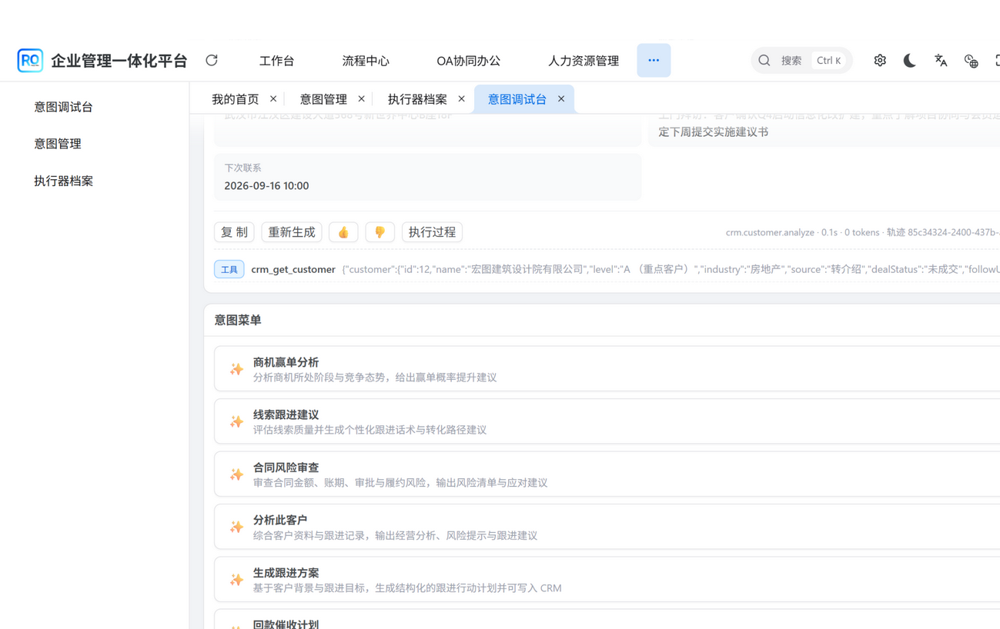
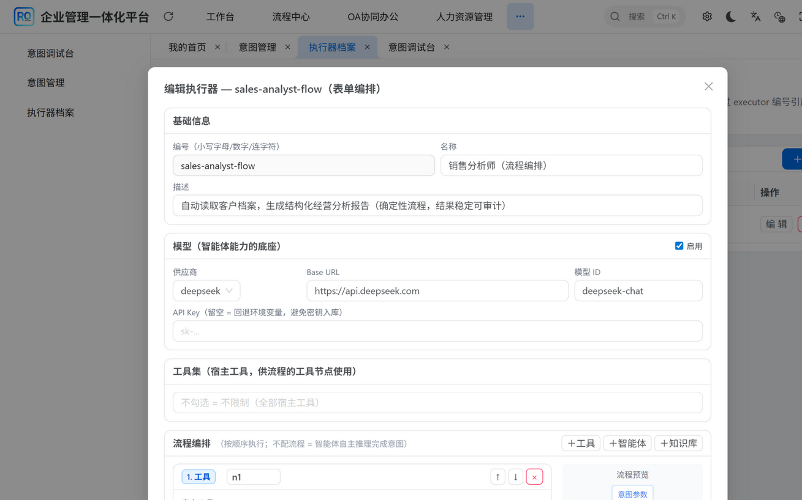
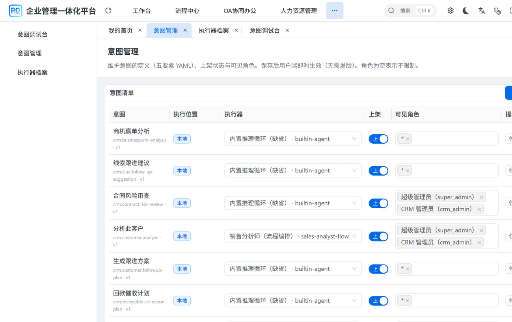

# 真实案例：我们如何在一套 CRM 业务系统里，打通「意图即服务」的完整通道

> 本文不是概念图，也不是 PPT 架构——以下每一张截图都来自一套**正在运行**的真实业务系统（企业管理一体化平台，含完整 CRM 模块）。意图的定义、执行器的配置、能力的编排、执行的结果与留痕，全部真实可用。

---

## 一、这张图里发生了什么


用户在 CRM 里选中一个客户，点击意图「分析此客户」。**没有聊天框，没有 prompt，没有等待生成的一大段废话**——直接返回一张结构化结果卡：

- 卡片标题「客户经营分析报告」来自执行器的出参模板，徽标「AI 生成 · 已通过输出校验」说明它符合意图契约定义的输出 Schema——不合格的内容根本到不了用户眼前；
- 标题下面是一段**人话摘要**：客户「宏图建筑设计院有限公司」（A（重点客户））当前成交状态：未成交。上次联系：上门拜访：客户确认 Q4 启动信息化改扩建……已排期下次联系：2026-09-16 10:00；
- 再往下是「**客户档案速览**」结构块：客户名称、所属行业、客户等级、来源渠道、成交状态、联系电话、办公地址、最近联系、下次联系——九项全部来自真实客户档案；
- 结果由**流程编排**产出：先调用宿主工具 `crm_get_customer` 读取真实客户数据，再按模板组装成标准卡片；
- 注意底部那一行：`crm.customer.analyze · 0.1s · 0 tokens · 轨迹 85c34324-…`——**全程零 token 消耗**。因为这个意图由"技能/流程型执行器"接管：查数据、组装结果，根本不需要大模型出场。

**这就是意图即服务的核心体验：用户点一下，事就办成了。**

## 二、每一步，皆有迹可循



点开「执行过程」，这次执行的轨迹就摆在眼前：进入流程的是 `crm_get_customer` 工具节点，它返回的**真实数据原样可见**——

`{"customer":{"id":12,"name":"宏图建筑设计院有限公司","level":"A（重点客户）","industry":"房地产","source":"转介绍","dealStatus":"未成交",…}}`

再配合底部那行执行标识 `crm.customer.analyze · 0.1s · 0 tokens · 轨迹 85c34324-2400-437b-…`：调了什么工具、拿到什么数据、花了多久、是哪一次执行——全部可追。这份留痕持久化存储，可回放、可审计。

企业级 AI 最低的底线是**可控**——AI 在你的系统里做了什么，必须像数据库事务一样有据可查。这是我们对"可信"的定义。

## 三、执行器：AI 能力被配置出来，而不是被开发出来



这张图是「执行器档案」页的编辑表单。一个执行器 = **模型 + 工具集 + 知识库 + 智能体等能力附件 + 可选的流程编排**：

- **模型**：供应商、端点、模型 ID 全部表单化，API Key 留空自动回退环境变量（密钥不入库）；
- **工具集**：直接勾选宿主系统注册好的业务工具（查客户、查商机、写跟进记录……）；
- **流程编排**：右侧就是流程图预览——意图参数 → 工具节点 → 智能体/知识库节点 → 结果卡片，每个节点可配条件跳过（when）与中止条件（stopWhen）；
- **出参模板**：标题 + 摘要 + 内容块三段式，模板里可直接引用前序节点返回的实体字段（`${nodes.n1.details.customer.name}`），把工具数据变成业务看得懂的卡片；
- **保存即生效**：配置热更新到运行时，不重启、不发版。

上面案例里的 `sales-analyst-flow`，档案就是下面这份（摘自运行中系统的真实内容，为可读性略去空字段并调整了字段顺序）：

```yaml
id: "sales-analyst-flow"
type: "agent"
name: "销售分析师（流程编排）"
description: "自动读取客户档案，生成结构化经营分析报告（确定性流程，结果稳定可审计）"
model:
  baseUrl: "https://api.deepseek.com"
  api: "openai-completions"
  provider: "deepseek"
  modelId: "deepseek-chat"
  contextWindow: 128000
  maxTokens: 8192          # apiKey 留空 → 自动回退环境变量，密钥不入库
tools: []                  # 不勾选 = 不限制，流程节点可用全部宿主工具
output:
  title: "客户经营分析报告"
  summary: "客户「${nodes.n1.details.customer.name}」（${nodes.n1.details.customer.level}）当前成交状态：${nodes.n1.details.customer.dealStatus}。上次联系：${nodes.n1.details.customer.contactLastContent}；已排期下次联系：${nodes.n1.details.customer.contactNextTime}。"
  blocks: "…"              # 结构块模板，展开见下
flow:
- id: "n1"
  type: "tool"
  tool: "crm_get_customer"
  args:
    customerId: "${params.customerId}"
```

`output.blocks` 展开后，就是结果卡里那张「客户档案速览」：

```json
[{"kind":"kv","title":"客户档案速览","items":[
  {"label":"客户名称","value":"${nodes.n1.details.customer.name}"},
  {"label":"所属行业","value":"${nodes.n1.details.customer.industry}"},
  {"label":"客户等级","value":"${nodes.n1.details.customer.level}"},
  {"label":"来源渠道","value":"${nodes.n1.details.customer.source}"},
  {"label":"成交状态","value":"${nodes.n1.details.customer.dealStatus}"},
  {"label":"联系电话","value":"${nodes.n1.details.customer.mobile}"},
  {"label":"办公地址","value":"${nodes.n1.details.customer.address}"},
  {"label":"最近联系","value":"${nodes.n1.details.customer.contactLastContent}"},
  {"label":"下次联系","value":"${nodes.n1.details.customer.contactNextTime}"}]}]
```

**AI 功能的交付物，从"一次开发项目"变成了一份配置档案。**

## 四、意图引用执行器：契约恒定，能力常新



意图管理页里，每个意图多了一列「执行器」下拉。截图中的对比就是这套模式的精髓：

- 其他意图引用 `builtin-agent`（内置推理循环：模型自主规划、多步调用工具）；
- 「分析此客户」引用了刚配置好的 `sales-analyst-flow`（流程编排：确定性执行、零 token）。

**同一个意图契约，切换执行器 = 切换整个实现方式**——从"AI 每次现场思考"到"流程按图执行"，或者反向切回来。业务定义一字不改，执行能力随时升级。这正是"意图与执行解耦"的价值：能力升级的收益，自动惠及所有引用它的意图。

---

## 五、这个通道的完整闭环

把四张图串起来，就是一条被验证打通的通道：

```
意图契约（做什么：槽位 + 页面 + 输出 Schema + 治理策略）
      │  通过 executor 编号引用
      ▼
执行器（谁来做：智能体 / 技能 / 流程编排，可随时切换）
      │  组合
能力附件（凭什么：模型 / 工具集 / 知识库 / 智能体，热插拔）
      │  执行
标准化结果（标题 + 摘要 + 内容块；NEED_INPUT 补全；全程留痕审计）
```

配套的工程事实：意图/执行器档案支持 YAML 种子 + 数据库管理页双模式、保存即强校验、错配在保存时明确报错、配置热更新、执行留痕 JSONL/数据库可替换。**它不是 DEMO，是一套可以进企业生产环境的集成模式。**

---

## 六、想把你的业务系统也改造成「意图即服务」？

这套模式已经抽象成可复用的集成方案：一套轻量的意图 SDK（Java，基于 pi-ai / pi-agent 的模型接入与推理循环）+ 宿主工具注册规范 + 执行器档案体系 + 管理页模板，可以嵌入绝大多数带后端的业务系统——不需要推翻现有架构，从注册第一个意图开始，逐步把 AI 能力长进你的业务里。

**如果你的系统也想完成这次升级——让 AI 从"外挂聊天框"变成"原生执行力"，欢迎联系：**

> **微信：harvey_danny**
>
> 聊聊你的业务场景，我们可以一起把第一批意图跑起来。
